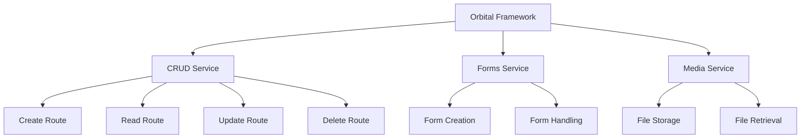

# orbital-api
Orbital Backend.

## Overview
The Orbital Framework is a powerful, modular programming framework designed for the AI age. It leverages the concept of "Orbital Units," which are functional building blocks that can be composed to create robust backend and frontend applications. This dual nature makes the Orbital Framework exceptionally powerful and flexible.

## Key Features
* Modular Design: Build applications by composing different modules that build on top of each other.
* Orbital Units: Fundamental building blocks of the framework, each responsible for specific functionalities.
* Full Stack Generation: Generate complete Node.js backend and React frontend code with a single command.
* Domain Logic Integration: Define custom logic for forms, media, CRUD operations, and more.

## Orbital Units
1. CRUD Service
The CRUD Service is responsible for creating, reading, updating, and deleting routes. It also handles form data storage and retrieval over HTTP and other interfaces.

2. Forms Service
The Forms Service manages the creation and handling of form data, ensuring smooth data flow and validation.

3. Media Service
The Media Service is used to store and retrieve files, providing a robust mechanism for managing media content within the application.

